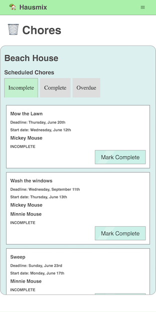
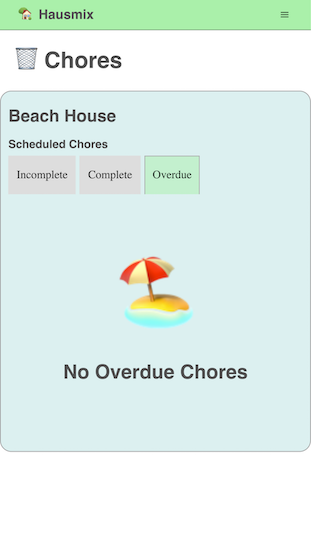
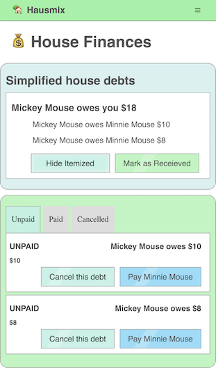
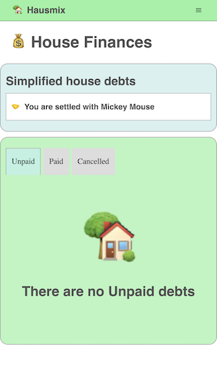

# Hausmix

Hausmix is a house management software designed for shared housemates and families. This initial implementation is targeted for housemates and shared chores.

Hausmix helps with scheduling chores and incentivising their completion through an innovative monetary reward system. The goal is to alleviate tensions and reduce conflict by having a flexible approach to chore management in shared homes. If your shared home is a mess, maybe it is time to mix in a new approach to how you keep your house tidy.

[hausmix.com](https://www.hausmix.com/)

## Built With

- [React](https://reactjs.org/) - The web framework used
- [React-apollo](https://apollographql.com/docs/react/) - GraphQL client
- [Next.js](https://nextjs.org/) - Routing / Server side rendering

### Frontend

- React
- Next.js
- Apollo Client
- GraphQL
- Styled Components
- Mobile & Desktop Responsive
- date-fns
- graphql-tag
- prop-types
- Webpack
- Babel

### Backend | [repo](https://github.com/setfloat/hausmix_node)

- Node.js
- Prisma
- MySQL
- GraphQL
- GraphQL Yoga
- MySQL
- bcryptjs
- date-fns
- JSONwebtoken
- nodemailer
- Amazon Simple Email Service (SES)
- DNS redirects, MX records, and DKIM email keys
- SSL certificates

### Future Features

- Future Features
- Track payments
- Add a utilities management system
- Family focused version for allowance management
- Multiple households per account
- Monetization ( Ideas are formed, but not ready to share! )
- Square Cash integration
- React native version (stretch goal)
- House account for shared tablets
- Calendar View / Integrations

### Future Enhancements

- Allow user to input flat payments - 'Joe paid \$20'
- User: settings, profile photo, permissions
- Household settings
- Take / Upload Pictures
- Edit recurring chores
- Add additional heads of house.
- Household / Account deletion
- Update Iconography

## Screenshots and GIF Walk-throughs

<!--  -->

Desktop view of the dashboard when a user is logged in.

***

Desktop view of the About page.

***

Mobile view of Chores page with Scheduled chores.

***

Mobile view of chores page when there are no overdue chores.

***

Mobile view of the debts page with unpaid debts.

***

Mobile view of the debts page when all debts are settled.

***

Desktop view of signup process.

***

Desktop view of household creation process. Email verification email is sent when a household is created.

***

Desktop view of sending an invitation to join the household. Email verification must be completed before the user can invite someone to join their household.  An invitation email is sent to the invited guest, where they can follow the link to sign up for an account and become a user.

***

Mobile view of creating a chore and view of the mobile nav menu. A chore can be scheduled to repeat at various frequencies, or be a one time event.  Multiple users can be assigned to the same chore. A start date and deadline is set so the chore is not displayed until the start date has passed. If the deadline has passed, the chore is converted to an overdue status and anyone may complete the chore. The original assignee(s) then split the value evenly and owe the person who completed the chore that debt.

## Authors

- **Patrick Richardson** - _Author of all work, content, and ideas._ - [LinkedIn](https://linkedin.com/in/setfloat) | [Twitter](https://twitter.com/setfloat)

## License

All work, code, design, and intellectual property of Hausmix is owned by Neighbor Labs LLC. Hausmix is currently not publicly licensed. To license Hauxmix please contact the developer listed above.
